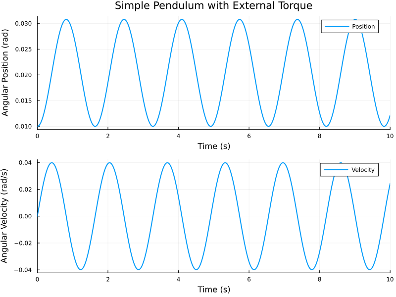

# ⚡ Simple Pendulum with External Torque

## 📊 Status Badges

| Badge | Status |
|-------|--------|
| **CI Pipeline** | [](https://github.com/digvijay1992/simple-pendulum-sciml/actions/workflows/ci.yml) |
| **Performance** | [](https://github.com/digvijay1992/simple-pendulum-sciml/actions/workflows/performance.yml) |
| **Julia Version** | [](https://julialang.org/) |
| **License** | [](https://opensource.org/licenses/MIT) |
| **Last Commit** |  |
| **Code Size** |  |


[](https://github.com/digvijay1992/simple-pendulum-sciml/stargazers)
[](https://github.com/digvijay1992/simple-pendulum-sciml/network/members)
[](https://github.com/digvijay1992/simple-pendulum-sciml/watchers)


> A numerical simulation of a simple pendulum system with external torque using Julia's DifferentialEquations.jl.
## 📌 Table of Contents
  - [📖 Overview](#-overview)
  - [📐 Equations](#-equations)
  - [💻 Code](#-code)
  - [📊 Results](#-results)
    - [Key Observations:](#key-observations)
  - [🛠️ Installation](#️-installation)
    - [Clone the Repository](#clone-the-repository)
    - [Install Required Packages](#install-required-packages)
  - [🚀 Usage](#-usage)
  - [📊 Parameters](#-parameters)
  - [📄 License](#-license)
  - [👤 Author](#-author)

## 📖 Overview

This project simulates a **simple pendulum** subjected to an **external torque** using **Julia** and the **SciML ecosystem**.

## 📐 Equations

The pendulum dynamics are governed by:
θ' = ω
ω' = -(3g)/(2l) * sin(θ) + 3/(m·l²) · Mₜ


Where:
- `θ` = angular position (rad)
- `ω` = angular velocity (rad/s)
- `g` = gravity (9.81 m/s²)
- `l` = length (1.0 m)
- `m` = mass (1.0 kg)
- `Mₜ` = external torque (0.1 Nm)

## 💻 Code

```julia
using DifferentialEquations, ModelingToolkit, Plots

function pendulum!(du, u, p, t)
    θ, ω = u
    g, l, m, Mt = p
    du[1] = ω
    du[2] = -(3*g)/(2*l) * sin(θ) + 3/(m*l^2) * Mt
end

u0 = [0.01, 0.0]
p = [9.81, 1.0, 1.0, 0.1]
tspan = (0.0, 10.0)

prob = ODEProblem(pendulum!, u0, tspan, p)
sol = solve(prob, Tsit5(), reltol=1e-8, abstol=1e-8)

p1 = plot(sol, idxs=(0,1), xlabel="Time (s)", ylabel="Angular Position (rad)", 
          title="Simple Pendulum with External Torque", label="Position", linewidth=2)
p2 = plot(sol, idxs=(0,2), xlabel="Time (s)", ylabel="Angular Velocity (rad/s)",
          label="Velocity", linewidth=2)

pic = plot(p1, p2, layout=(2,1), size=(800,600))
savefig(pic, joinpath(@__DIR__, "pendulum.png"))
```

## 📊 Results



### Key Observations:
- **Angular Position:** Oscillates between approximately ±0.03 rad
- **Angular Velocity:** Alternates between ±0.04 rad/s
- **External Torque Effect:** The external torque (0.1 Nm) maintains periodic motion

## 🛠️ Installation

### Clone the Repository
```bash
git clone https://github.com/digvijay1992/simple-pendulum-sciml.git
cd simple-pendulum-sciml
julia
```

### Install Required Packages
Once in Julia REPL, run:
```julia
using Pkg
Pkg.add("DifferentialEquations")
Pkg.add("ModelingToolkit")
Pkg.add("Plots")
exit()
```

## 🚀 Usage
```bash
julia A2P1.jl
```

## 📊 Parameters

| Parameter | Value | Units |
|-----------|-------|-------|
| Gravity (g) | 9.81 | m/s² |
| Length (l) | 1.0 | m |
| Mass (m) | 1.0 | kg |
| External Torque (Mₜ) | 0.1 | Nm |
| Initial Angle (θ₀) | 0.01 | rad |

## 📄 License

This project is licensed under the MIT License — see the [LICENSE](LICENSE) file for details.

## 👤 Author

**Digvijay Singh**

GitHub: [@digvijay1992](https://github.com/digvijay1992)

---

## Acknowledgments

Thank you for visiting this repository.

For issues, suggestions, or contributions, please open an issue or submit a pull request.


| Metric | Value |
|--------|-------|
| 📅 Last Update | 2026-05-26 |
| 📊 Total Commits | 1 |
| ✅ Project.toml | true |
| 🔄 CI Status | [](https://github.com/digvijay1992/simple-pendulum-sciml/actions/workflows/ci.yml) |


| Metric | Value |
|--------|-------|
| 📅 Last Update | 2026-05-26 |
| 📊 Total Commits | 1 |
| ✅ Project.toml | true |
| 🔄 CI Status | [](https://github.com/digvijay1992/simple-pendulum-sciml/actions/workflows/ci.yml) |


| Metric | Value |
|--------|-------|
| 📅 Last Update | 2026-05-26 |
| 📊 Total Commits | 1 |
| ✅ Project.toml | true |
| 🔄 CI Status | [](https://github.com/digvijay1992/simple-pendulum-sciml/actions/workflows/ci.yml) |


| Metric | Value |
|--------|-------|
| 📅 Last Update | 2026-05-26 |
| 📊 Total Commits | 1 |
| ✅ Project.toml | true |
| 🔄 CI Status | [](https://github.com/digvijay1992/simple-pendulum-sciml/actions/workflows/ci.yml) |

## 📊 Project Status

### 📈 Live Metrics
| Metric | Value |
|--------|-------|
| 📅 Last Update | 2026-05-26 |
| 📊 Total Commits | 1 |
| ✅ Project.toml | true |
| 🔄 CI Status | [](https://github.com/digvijay1992/simple-pendulum-sciml/actions/workflows/ci.yml) |
